# ASIS - Documento Técnico

## 1. Informações gerais

ASIS é um ecossistema para análise de situação de saúde, composto por:

- **Backend**: Sistema _open source_ para desenvolvimento, responsável por
  gerenciar dados relevantes de saúde para apresentação no **Metabase**;

- **Metabase**: Sistema _open source_, da empresa Expa, responsável por
  gerenciar painéis (_dashboards_) de visualização em gráficos e mapas de dados
  relevantes de saúde;

- **PostgreSQL**: Sistema de gerenciamento de banco de dados (**DBMS** -
  _Database management system_, em inglês), responsável por gerenciar os dados
  definidos pelo **Backend** e que serão apresentados no **Metabase**.

A figura abaixo descreve o fluxo de dados do ecossistema:

<!-- markdownlint-disable MD033 -->
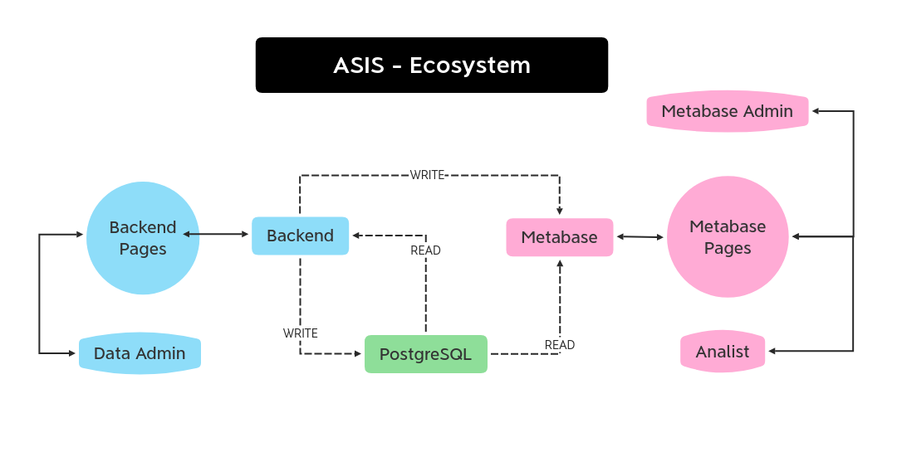
<!-- markdownlint-enable MD033 -->

> Figura 1 - Ecossistema ASIS

- **Administrador de dados**: É o papel de um usuário capaz de administrar os
  dados do sistema. Ele interage diretamente com as páginas _web_ do **Backend**
  para visualizar e atualizar os dados contidos no banco de dados
  **PostgreSQL**;

- **Pagínas do Backend**: Páginas _web_ renderizadas pelo **Backend**;

- **Backend**: O sistema que gerencia os dados e disponibiliza páginas _web_
  para usuários administradores de dados. Adicionalmente, se possível, ele será
  capaz de se comunicar com o Metabase para adicionar painéis de forma autônoma;

- **PostgreSQL**: Sistema de gerenciamento de banco de dados;

- **Administrador do Metabase**: É o papel de um usuário capaz de administrar as
  configurações do Metabase, dos painéis e de outros usuários e seus papéis;

- **Analista**: É o papel de um usuário capaz de visualizar os painéis do
  Metabase;

- **Metabase**: É o sistema que gerencia os painéis de visualizações dos dados
  contidos no **PostgreSQL**.

## 2. Definições do Backend

O **Backend** é o sistema para desenvolvimento responsável por gerenciar dados
relevantes de saúde para apresentação no **Metabase**.

Principais requisitos são:

- **R01**: Deve manter dados de agrupamentos geográficos, incluindo latitude e
  longitude do ponto central, organizados segundo a hierarquia brasileira:

  - Municípios

  - Microrregiões

  - Mesorregiões

  - Estados

  - Regiões

  - Países

  - Continentes

  - Global

- **R02**: Deve manter os seguintes dados demográficos de um determinado
  município em um determinado ano:

  - População residente

  - População residente por sexo (masculino e feminino)

  - População residente por faixa etária

    - Entre 0 e 4 anos, inclusive

    - Entre 5 e 9 anos, inclusive

    - Entre 10 e 14 anos, inclusive

    - Entre 15 e 19 anos, inclusive

    - Entre 20 e 29 anos, inclusive

    - Entre 30 e 39 anos, inclusive

    - Entre 40 e 49 anos, inclusive

    - Entre 50 e 59 anos, inclusive

    - Entre 60 e 69 anos, inclusive

    - Entre 70 e 79 anos, inclusive
    - De 80 anos ou mais

- **R03**: Deve manter dados de doenças e ocorrências de saúde segundo o padrão
  CID-10 (**ICD-10**, em inglês), composto por:

  - Capítulos: Categorias de doenças e ocorrências de saúde

  - Blocos: Sub-categorias de doenças e ocorrências de saúde

  - Doenças ou Ocorrrências

  - Sub-tipos de doenças ou ocorrências

- **R04**: Deve manter integralmente registros de natalidade (DN) de acordo com
  as definições da Secretária de Vigilância em Saúde. Informações sensíveis
  devem ser ignoradas;

- **R05**: Deve manter integralmente registros de óbito (DO) de acordo com as
  definições da Secretária de Vigilância em Saúde. Informações sensíveis devem
  ser ignoradas;

- **R06**: Deve manter integralmente registros de morbidade de acordo com as
  definições do DATASUS. Informações sensíveis devem ser ignoradas;

- **R07**: Deve consolidar indicadores de saúde através do mapeamento entre os
  diferentes registros;

- **R08**: Se possível, deve gerar os painéis no **Metabase** automaticamente,
  de acordo com os dados mantidos, através de comunicação HTTPS com a API do
  **Metabase**;

- **R09**: Deve restringir o acesso para usuários credenciados.

## 3. _Frameworks_ e tecnologias

O **Backend** será desenvolvido em linguagem **Elixir** (`v1.10`), utilizando
dos seguintes _frameworks_:

- **Phoenix** (`v1.5.4`) - Para renderizar páginas em um servidor _web_
  permitindo visualizar, criar, editar e remover dados relevantes de saúde;

- **PhoenixLiveView** (`v0.14.4`) - Para renderizar páginas com _websockets_ em
  um servidor **Phoenix**, visando a recepção e manipulação de dados em tempo
  real;

- **PhoenixLiveDashboard** (`v0.2.7`) - Para analisar a integridade do
  **Backend** e de seu sistema operacional em tempo real;

- **Ecto** (`v3.4.5`) - Para integrar a arquitetura de dados com o banco de
  dados **PostgreSQL** de forma agnóstica atráves de mapeamento
  objeto-relacionamento (**ORM** - _Object relational mapping_, em inglês) e
  para gerar _queries_ das modelos mantidas no banco de dados **PostgreSQL**;

- **NimbleCSV** (`v0.7.0`) - Para importar dados advindos de arquivos CSV
  durante o _seeding_ ou através do servidor _web_ criado com **Phoenix**;

- **Tesla** (`v1.3.3`) - Para comunicação com a API do **Metabase** visando
  automatizar o processo de criação dos painéis.

Adicionamente, as seguintes tecnologias serão utilizadas:

- **Coveralls** (`v0.13.1`): Para realizar e consolidar resultados de testes
  automatizados unitários e de integração

- **Credo** (`v1.4.0`): Para realizar e consolidar resultados de análise
  estática do código-fonte

- **Git**: Para versionamento do código-fonte;

- **GitHub**: Para disponibilização do código-fonte na nuvem;

- **GitLab**: Para manter arquivos de dados que não devem ser disponibilizados
  de forma aberta;

- **GitHub Actions**: Para testes automatizados, integração e entrega contínua
  (**CI/CD** - _Continuous Integration / Continous Delivery_, em inglês);

- **Ansible**: Para gerar tarefas automatizadas para integração e entrega
  contínua;

- **Docker** (`v19.03.0+`): Para gerar e utilizar de imagens do sistema para
  desenvolvimento, testes e infraestrutura do ambiente de produção;

- **Docker Compose** (`v3.8`): Para subir o ecossistema para desenvolvimento;

- **Docker Swarm**: Para manter o ecossistema no ambiente de produção;

- **NGINX**: Para _proxy_ reverso no ambiente de produção;

- **Certbot**: Para gerar e atualizar as certificações SSL no ambiente de
  produção;

## 4. Padrões arquiteturais e de escrita

O código-fonte do **Backend** será padronizado seguindo a folha de estilo
amplamente utilizada pela comunidade Elixir e disponibilizada por René Föhring
no GitHub, integrado no **Credo** para testes automatizados.

A árvore de diretórios será padronizada seguindo o padrão de contextos do
_framework_ Phoenix.

A arquitetura do projeto será construída de acordo com o padrão
Modelo-Contexto-Controladora (**MCC** - _Model-Context-Controller_, em inglês)
do _framework_ Phoenix.

A figura abaixo descreve o comportamento do padrão MCC para uma requisição
típica no sistema:

<!-- markdownlint-disable MD033 -->
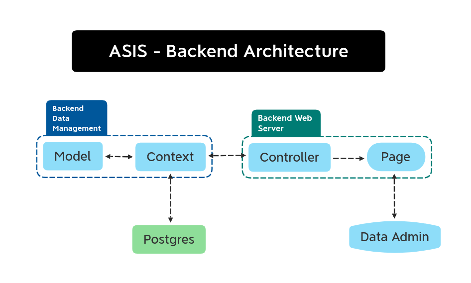
<!-- markdownlint-enable MD033 -->

> Figura 2 - Arquitetura do **Backend**

- Ao requisitar uma página ou uma operação em uma página, o administrador de
  dados se comunica com o servidor _web_;

- O servidor _web_ verifica nas definições de rotas do sistema qual a
  controladora (_controller_, em inglês) responsável pela rota;

- A controladora recebe a requisição e, se necessário, se comunica com um ou
  mais contextos para receber ou enviar dados para o banco de dados;

- O contexto, utilizando das definições de modelos, requisita ou envia ao
  **PostgreSQL** os dados;

- O resultado da operação do contexto é enviado para a controladora, que este
  renderiza a resposta na página.

## 5. Modelo de dados

O diagrama de modelo de dados para o projeto é descrito na figura abaixo:

<!-- markdownlint-disable MD033 -->
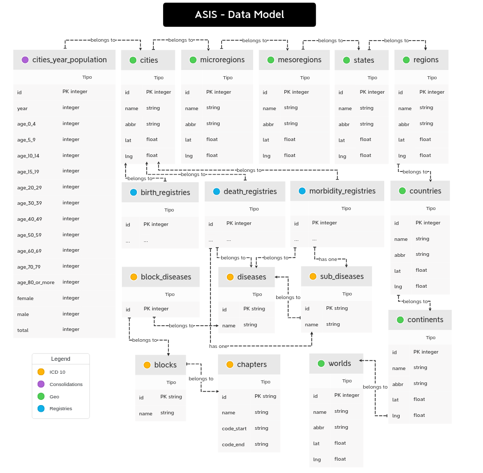
<!-- markdownlint-enable MD033 -->

> Figura 3 - Modelo de dados

São definidos 4 contextos de modelos:

- **Consolidações**: Agrupamento de modelos que mantêm dados consolidados
  relevantes para o contexto de análise de situação de saúde. Inicialmente,
  consistirá de apenas uma modelo:

  - **População de cidades por ano**: Descreve a sumarização demográfica de uma
    determinada cidade em um determinado ano.

- **CID-10**: Agrupamento de modelos que mantêm o repertório completo da
  classificação internacional de doenças, de acordo com sua décima revisão. As
  modelos são:

  - **Capítulos**: Conjunto de blocos que caracteriza um grupo de doenças ou
    ocorrências de saúde;

  - **Blocos**: Conjunto de doenças ou ocorrências de saúde. Há blocos de blocos
    menores que se associam;

  - **Doenças**: Doenças ou occorências de saude. Possuem ao menos um bloco
    associado;

  - **Doenças de um bloco**: Modelo que permite que vários blocos possuam várias
    doenças, e vice-versa (_many-to-many_, em inglês);

  - **Subtipos de doença**: Subtipos de doença ou ocorrência de saúde.

- **Geográfico**: Agrupamento de modelos que descrevem agrupamentos geográficos.
  São eles:

  - **Mundo**: Descreve o agrupamento global;

  - **Continentes**: Descrevem continentes;

  - **Países**: Descrevem países;

  - **Regiões**: Descrevem divisões geográficas de um país que agrupam estados;

  - **Estados**: Descrevem estados;

  - **Mesorregiões**: Descrevem agrupamentos de microrregiões com similaridades
    econômicas ou sociais;

  - **Microrregiões**: Descrevem agrupamentos de municípios limítrofes com
    organização espacial em comum;

  - **Municípios**: Descrevem municípios.

- **Registros**: Agrupamento de modelos que disponibilizam de forma integral
  registros de saúde. Inicialmente é contemplado:

  - **Registros de nascimento** (DN): Descrevem registros de saúde de
    nascimento;

  - **Registros de óbito** (DO): Descrevem registros de saúde de óbito;

  - **Registros de morbidade**: Descrevem registros de saúde de morbidade.

Tais modelos serão atualizadas de acordo com a necessidade e de acordo com a
variação dos requisitos. Tais mudanças serão registradas em arquivos de migração
com instruções para o sistema de como atualizar seus dados no banco.

## 6. Protótipos

Roraima será o primeiro estado que receberá o ecossistema dedicado com dados
regionalizados.

As figuras abaixo descrevem exemplos de páginas de painéis no **Metabase**:

<!-- markdownlint-disable MD033 -->
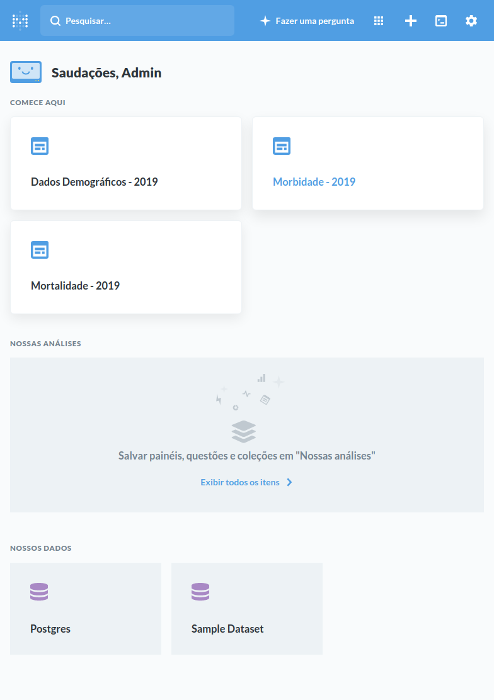
<!-- markdownlint-enable MD033 -->

> Figura 4 - Listagem de Painéis no Metabase

<!-- markdownlint-disable MD033 -->
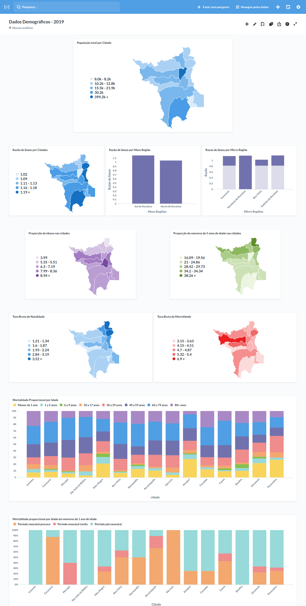
<!-- markdownlint-enable MD033 -->

> Figura 5 - Painel demográfico no Metabase

<!-- markdownlint-disable MD033 -->
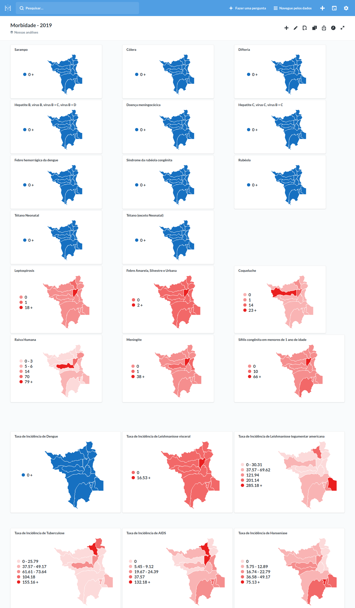
<!-- markdownlint-enable MD033 -->

> Figura 6 - Painel de morbidade no Metabase

<!-- markdownlint-disable MD033 -->
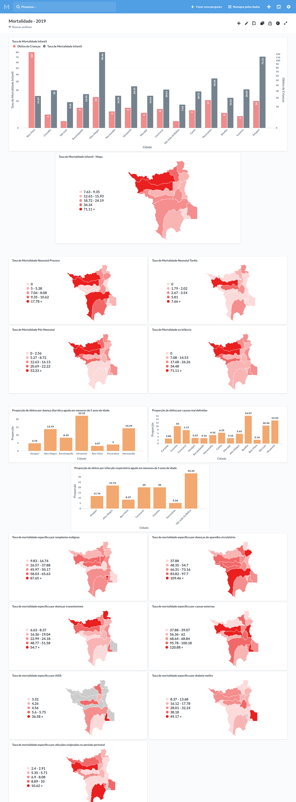
<!-- markdownlint-enable MD033 -->

> Figura 7 - Painel de mortalidade no Metabase

As figuras abaixo descrevem exemplos de páginas administrativas no **Backend**:

<!-- markdownlint-disable MD033 -->
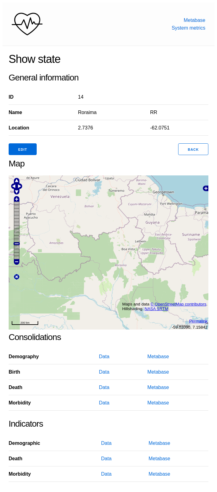
<!-- markdownlint-enable MD033 -->

> Figura 8 - Visualização de dados de um estado no Backend

<!-- markdownlint-disable MD033 -->
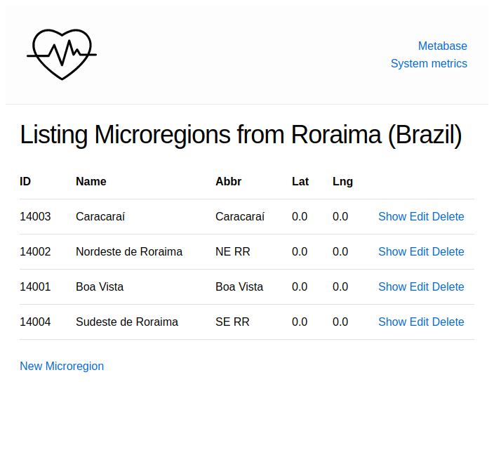
<!-- markdownlint-enable MD033 -->

> Figura 9 - Visualização de microrregiões de um estado no Backend

<!-- markdownlint-disable MD033 -->
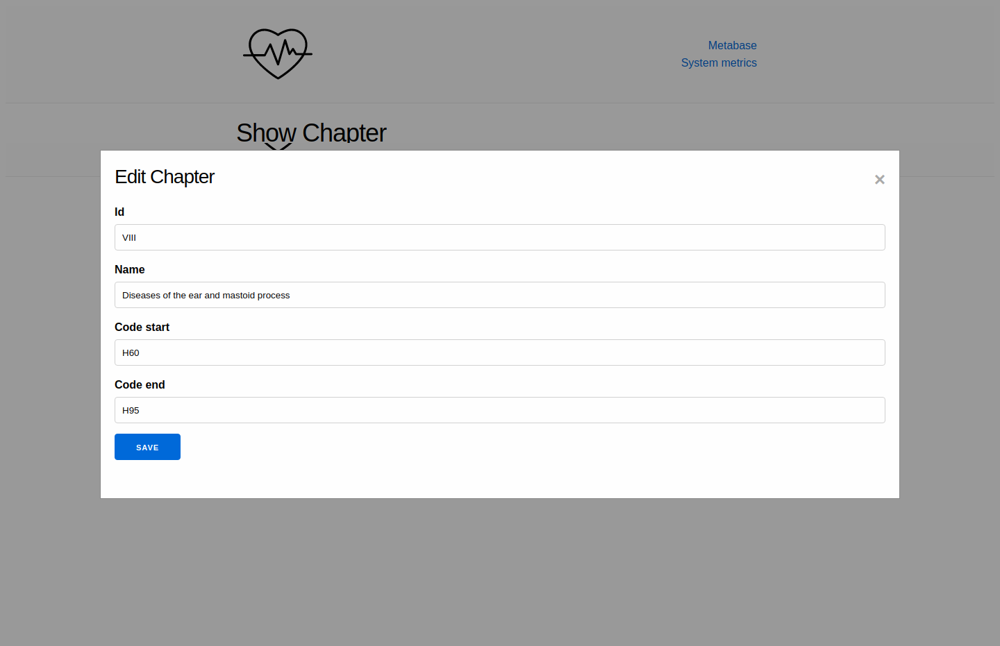
<!-- markdownlint-enable MD033 -->

> Figura 10 - Modificação de um capítulo do CID-10 no Backend

<!-- markdownlint-disable MD033 -->
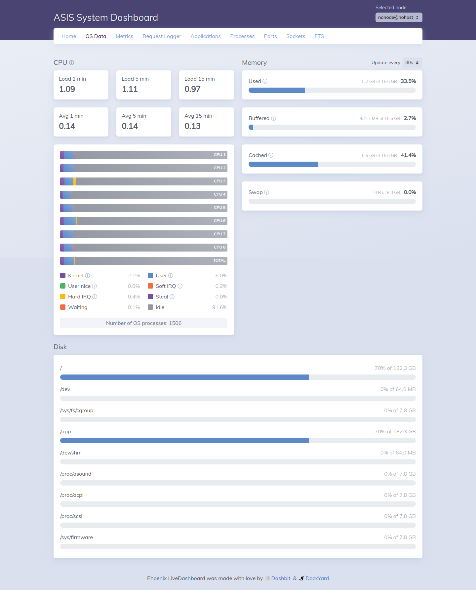
<!-- markdownlint-enable MD033 -->

> Figura 11 - Visualização do painel de monitoramento do sistema do Backend
